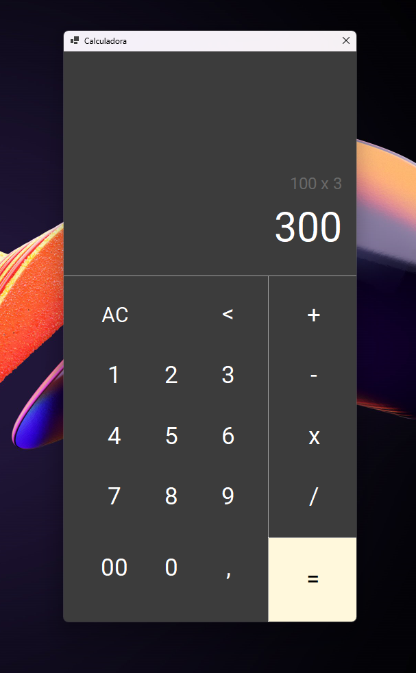

# Calculadora Básica 🧮

## Projeto 🗂️
Uma calculadora desenvolvida em C#, .NET, Windows Forms, com funcionalidades básicas de adição, subtração, multiplicação e divisão; e funcionalidades de reset, apagar, histórico imediato e operações a partir do resultado anterior.

## Como usar 📝
Basta executar o arquivo .exe em **Calculadora\bin\Release\net8.0-windows**
- **<** : Apagar último digito
- **AC** : Reset calculadora

## Pontos de atenção ⚠️
- Somente é possível realizar uma operação por vez, do tipo: ****NUMERO1 {{OPERACAO}} NUMERO2****
- Após cada operação, o resultado é utilizado como priemiro número da próxma operação

### Boas Contas 💡